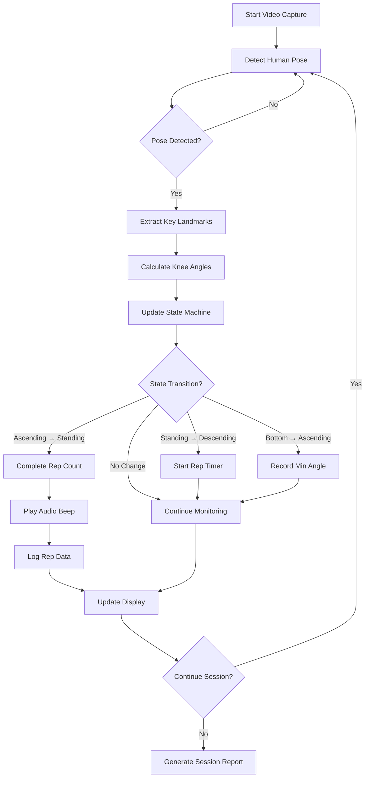

```mermaid
flowchart TD
    A[Start Video Capture] --> B[Detect Human Pose]
    B --> C{Pose Detected?}
    C -->|No| B
    C -->|Yes| D[Extract Key Landmarks]
    D --> E[Calculate Knee Angles]
    E --> F[Update State Machine]
    F --> G{State Transition?}
    G -->|Standing → Descending| H[Start Rep Timer]
    G -->|Bottom → Ascending| I[Record Min Angle]
    G -->|Ascending → Standing| J[Complete Rep Count]
    G -->|No Change| K[Continue Monitoring]
    H --> K
    I --> K
    J --> L[Play Audio Beep]
    L --> M[Log Rep Data]
    M --> N[Update Display]
    K --> N
    N --> O{Continue Session?}
    O -->|Yes| B
    O -->|No| P[Generate Session Report]
```

**
Fitness Tracking Workflow
**
