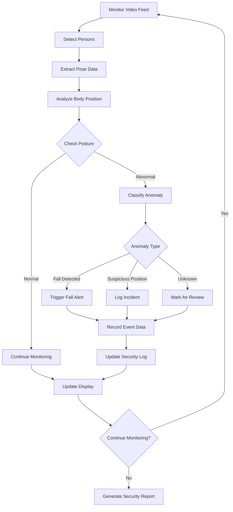

```mermaid
flowchart TD
    A[Monitor Video Feed] --> B[Detect Persons]
    B --> C[Extract Pose Data]
    C --> D[Analyze Body Position]
    D --> E{Check Posture}
    E -->|Normal| F[Continue Monitoring]
    E -->|Abnormal| G[Classify Anomaly]
    G --> H{Anomaly Type}
    H -->|Fall Detected| I[Trigger Fall Alert]
    H -->|Suspicious Position| J[Log Incident]
    H -->|Unknown| K[Mark for Review]
    I --> L[Record Event Data]
    J --> L
    K --> L
    L --> M[Update Security Log]
    F --> N[Update Display]
    M --> N
    N --> O{Continue Monitoring?}
    O -->|Yes| A
    O -->|No| P[Generate Security Report]
```

**
Surveillance Detection Workflow
**