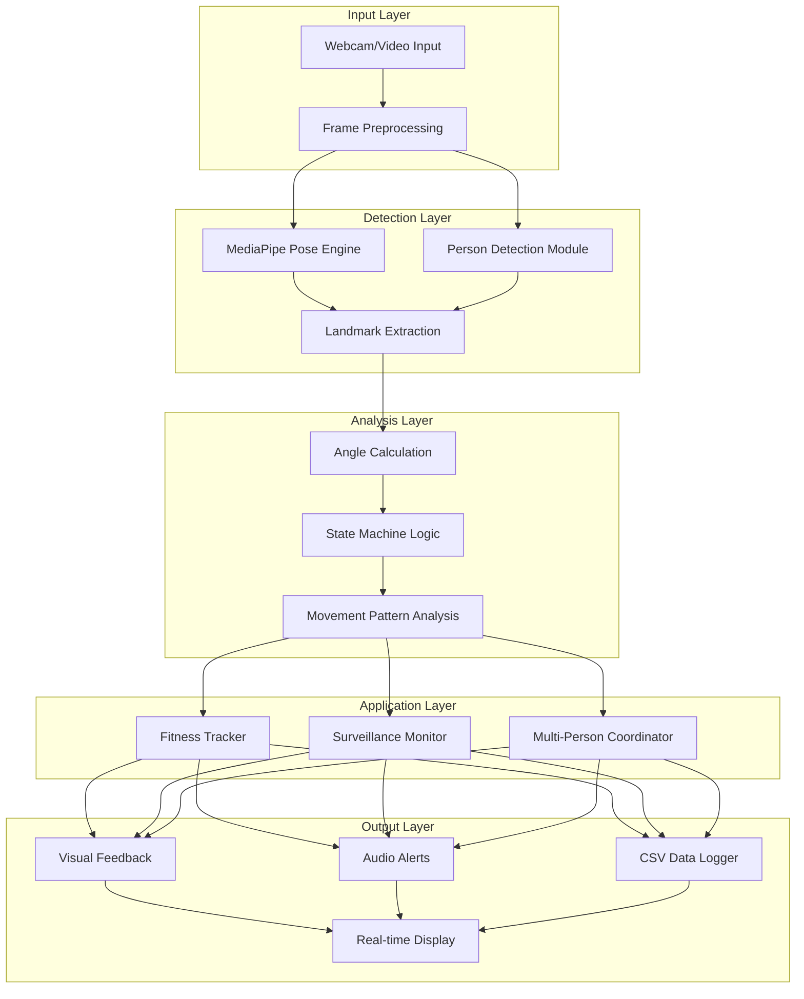

```mermaid
graph TB
    subgraph "Input Layer"
        A[Webcam/Video Input]
        B[Frame Preprocessing]
    end
    
    subgraph "Detection Layer"
        C[MediaPipe Pose Engine]
        D[Person Detection Module]
        E[Landmark Extraction]
    end
    
    subgraph "Analysis Layer"
        F[Angle Calculation]
        G[State Machine Logic]
        H[Movement Pattern Analysis]
    end
    
    subgraph "Application Layer"
        I[Fitness Tracker]
        J[Surveillance Monitor]
        K[Multi-Person Coordinator]
    end
    
    subgraph "Output Layer"
        L[Visual Feedback]
        M[Audio Alerts]
        N[CSV Data Logger]
        O[Real-time Display]
    end
    
    A --> B
    B --> C
    B --> D
    C --> E
    D --> E
    E --> F
    F --> G
    G --> H
    H --> I
    H --> J
    H --> K
    I --> L
    I --> M
    I --> N
    J --> L
    J --> M
    J --> N
    K --> L
    K --> M
    K --> N
    L --> O
    M --> O
    N --> O
```
